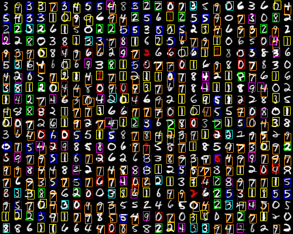

# bmp-template-matching
BMP image template matching algorithm. 

## INSTALLATION
```bash
gcc -o executable app.c
```

## USAGE
```bash
./executable [sourcePath] [destinationPath] [listPath] [matchThreshold] [overlapThreshold]
```
  
* **sourcePath** - path to image  
* **destinationPath** - path to output  
* **listPath** - path to .txt file containing a list of up to 10 paths to BMP images (samples)
* **matchThreshold** - threshold for a match (between 0.0 and 1.0)  
* **overlapThreshold** - threshold for overlapping matches (between 0.0 and 1.0)

## EXAMPLE
We will try to match samples of the 0-9 digits against an image of hand-written digits. Each digit will have its own color.<br><br>
**input:**  


  
  

**output:**  
```bash
./executable ./example/testIn.bmp ./example/testOut.bmp ./example/samples.txt 0.45 0.2
```


## HOW IT WORKS
The algorithm will try to match a list of BMP samples with another BMP image. Check [Template-Matching](https://en.wikipedia.org/wiki/Template_matching) for more information.
* First the images will be grayscaled.
* A list of matches with a [correlation](https://en.wikipedia.org/wiki/Cross-correlation) value higher than the **matchThreshold** will be generated for each sample. 
* The matches are then filtered: if two matches overlap (determined by the **overlapThreshold**) the match with the greatest correlation value will be chosen.
* Matches will be highlighted and written to the output file.
